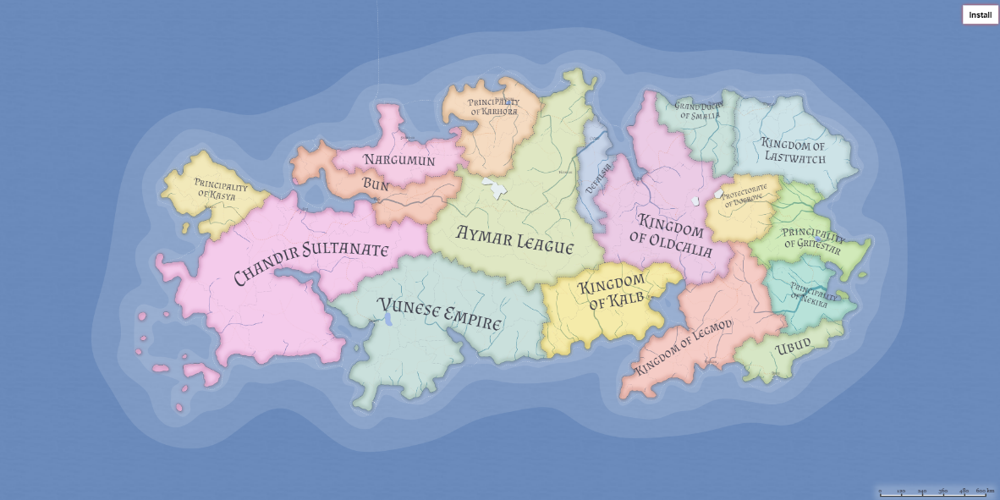

# Documentação Do Código

## Main 🎮
- Local onde o jogo é executado
- São instanciandos as classes ```Menu.java``` e ```Game.java```
- Ao executar, usa-se a função ```menu.startMenu()```, essa função mostrará as opções:
    - 1. Começar a Aventura
    - 2. Sobre o Jogo
    - 3. Sair
- Após isso, é chamada a função ```menu.requestInputNumber()```, que retornará o input digitado pelo usuário, passando um arraylist com 3 opções para validar erros como:
    - Inserir um valor que seja diferente de 1,2 e 3
    - Inserir um string ou caracteres especiais ao invés de um número inteiro
    - Deixar o campo vazio
- Logo depois, um loop é iniciaido caso opção digitada seja inválida e é usado um swtich/case para manipular a opção desejada
- Caso seja 1: A função ```game.run()``` é executada
- Caso seja 2: A função ```menu.aboutGameMenu()``` é executada
- Caso seja 3: A aplicação é finalizada

## Map 🗺️
- Clase responsável por gerenciar tudo a respeito das cidades do jogo.
- Atributos:
    - Todas as cidades do jogo
- Principais métodos:
    - [x] ```Map()```: Construtor da classe que executa as funções abaixo:
        - [x] ```setFrontiers()```: Responsável por configurar as fronterias e o poder ao chegar em cada cidade do jogo. Essa configuração é feita através da chamada o método ```addFrontier()``` em cada cidade/atributo do mapa.
        - [x] ```setMissionsToCities()```: Responsável por configurar as missões nas cidades Kalb, Defalsia e Vunese Empire. Essa configuração é feita através da criação de 3 instâncias da classe ```Mission.java```. Após isso, por meio da chamada do método ```setMission()``` de cada cidade é passado como parâmetro um das instâncias criadas




## City 📌
- Classe responsável por representar cada cidade do jogo.
- Atributos: 
    - String name
    - ArrayList frontiers
    - boolean hasMission
    - Merchant merchant
    - int powerUp
    - Mission mission
- Principais Métodos:
    - [x] ```addFrontier()```: Responsável por adicionar um fronteira, instanciando a classe ```Frontier.java``` que recebe como parâmetros, a cidade de destino e o aumento/redução de poder ao entrar nessa cidade alvo. E adiciona essa fronteira no arraylist que armazena as fronteiras dessa cidade.
    - [x] ```blockGetMissionAgain()```: Responsável por impedir o jogador de iniciar a missão da cidade novamente. Esse bloqueio é feito quando o jogador rejeita, abandona ou completa a missão. Nesse função, é feita uma verificação se na cidade tem uma missão atráves do acesso do atributo hasMission, caso seja true, é chamado o método ```setMission()``` passando null como parâmetro e o atributo hasMission é configurado para ser igual a false.

## Mission 🎯
- Classe responsável por representar cada missão do jogo
- Atributos:
    - int travelCoinsToAccept
    - int travelCoinsToComplete
    - int thresholdToComplete
    - String goal
    - City cityTarget
- Principais Métodos: 
    - [x] ```reward()```: Responsável por recompensar o Maxwell por finalizar a missão, recebendo a instância do personagem para atualizar as informações de moedas de tranporte e limiar de poder, acessando os atributos das moedas de transporte e de limiar. Com isso, por meio do método ```setTravelCoins()```  é passado como parâmetro as moedas atuais somado com o valor do atributo travelCoinsToComplete acessado dentro da classe da missão. O método ``setCurrentThreshold()`` também é chamado, o parâmetro que é passado o limiar atual somado com o valor do atributo thresholdToComplete também acesso dentro da classe da missão.
    - [x] ```complete()```: Responsável por avisar que a missão foi concluir e executar o método ```reward()``` para recompensar o jogador. Támbem  os atributos de currentMission e onMission do jogador são configurador para null e false respectivamente, por meio dos métodos ```setCurrentMission()``` e ```setOnMisison()``` respectivamente.

## Menu 📋
- Classe responsável pela exibição dos menus principais no terminal
- Métodos de Exibição:
    - [x] ```startMenu()```: Responsável por mostrar o menu incial do jogo
    - [x] ```aboutGameMenu()```: Responsável por mostrar as informações do jogo
    - [x] ```defaultMenu()```: Exibido quando o personagem Maxwell não está em uma missão
    - [x] ```travelMenu()```: Exibido quando o jogador escolhe viajar para uma cidade
    - [x] ```acceptMissionMenu()```: Exibido para avisar o jogodador que na cidade atual tem uma missão e pergunta-lo se deseja aceitar ou recusar a missão 
    - [x] ```changeMissionConfirmation()```: Exibido quando o jogador está fazendo uma missão e chega em uma cidade que também tem uma missão, esse menu pergunta ao jogador se ele deseja abortar a sua missão atual e inciar a nova.
    - [x] ```onMissionMenu()```: Exibido quando o personagem Maxwell está em uma missão
    - [x] ```merchantFirstQuestion()```: Responsável por exibir a primeira pergunta do Mercador
    - [x] ```merchantSecondQuestion()```: Responsável por exibir a segunda pergunta do Mercador
    - [x] ```rewardMessage()```: Responsável por exibir a recompensa Mercador
    - [x] ```ariveAtNargumunMessage()```: Mostra a mensagem quando o jogador chega na cidade de Nargumun com base na quantidade de moedas de tranporte que o jogador chega.
